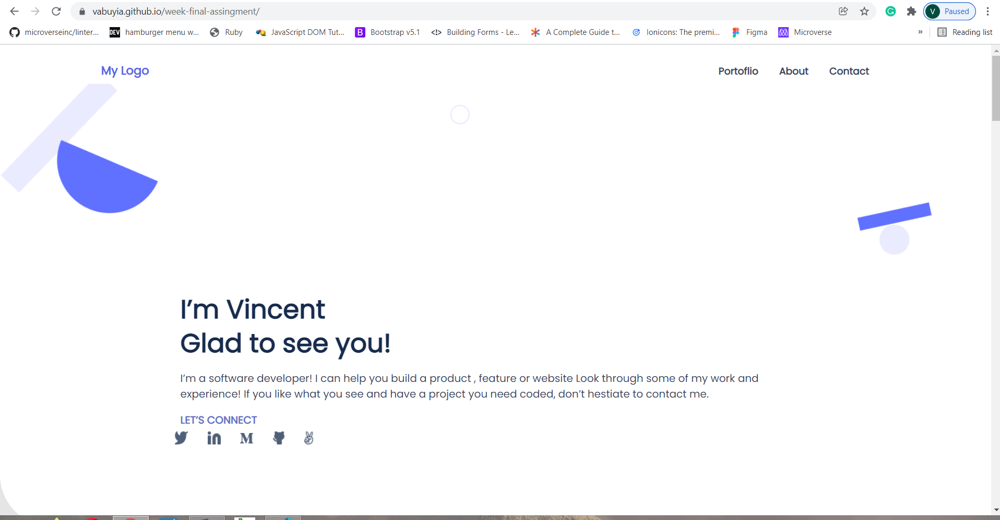

# Portfolio: validate contact form

You need to implement a simple validation:

Project: Sneak peek: your portfolio.

This Project is a clone of the figma template 1 (https://figma.com/)
A responsive design

## Built With

- HTML
- CSS
- Javascript

## Live Demo

Click [here](https://vabuyia.github.io/week-final-assingment/) to go to my application deployment.

## Authors

- Name: Vincent Abuya
- GitHub: [@githubhandle](https://github.com/vabuyia))
- Twitter: [@twitterhandle](vabuyia.com)
- LinkedIn: [LinkedIn](vabuyia.com)

## 🤝 Contributing

Contributions, issues, and feature requests are welcome!

Feel free to check the [issues page]().

## Show your support

Give a ⭐️ if you like this project!

## Acknowledgments

- Hat tip to anyone whose code was used
- Inspiration
- etc

## 📝 License

# This project is [MIT](lic.url) licensed.
